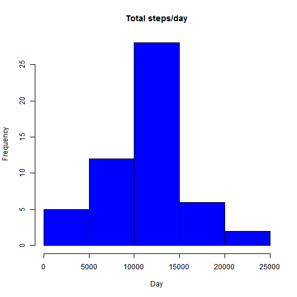
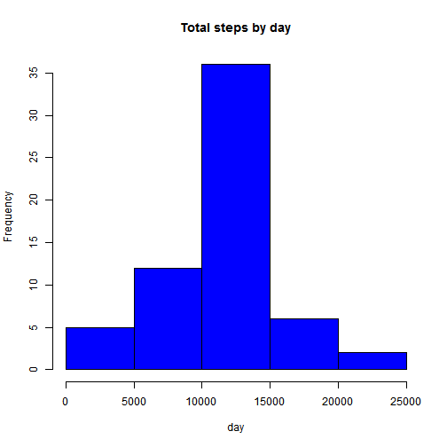

#Reproducible Research : Peer Assessment 1
========================================================

##Reading and Processing the data file


```r
activity<- read.csv("E:/Coursera_Materials/reproducebleResearch/activity.csv",colClasses=c("numeric", "character", "numeric"))

head(activity)
```

```
##   steps       date interval
## 1    NA 2012-10-01        0
## 2    NA 2012-10-01        5
## 3    NA 2012-10-01       10
## 4    NA 2012-10-01       15
## 5    NA 2012-10-01       20
## 6    NA 2012-10-01       25
```

```r
names(activity)
```

```
## [1] "steps"    "date"     "interval"
```

```r
library(lattice)
```

```
## Warning: package 'lattice' was built under R version 3.0.3
```

```r
activity$date<- as.Date(activity$date, "%Y-%m-%d")
```
## What is mean total no. of steps taken per day?

### to do this I am using aggregate function

```r
TotalSteps<-aggregate(steps ~ date, data=activity, sum, na.rm=T)
```
### using "hist" to generate histogram 

```r
hist(TotalSteps$steps, main="Total steps/day", xlab="Day", col="blue")
```

 
###The mean, and median of total no of steps

```r
mean(TotalSteps$steps)
```

```
## [1] 10766
```

```r
median(TotalSteps$steps)
```

```
## [1] 10765
```

##What is the average daily activity pattern?


```r
TimeSeries<- tapply(activity$steps, activity$interval, mean, na.rm=T)
```
####plot this


```r
lot(row.names(TimeSeries), TimeSeries, type ="l", xlab="5-minute interval", ylab="Average across all Days", main="Average no. of Steps", col="blue")
```

```
## Error: could not find function "lot"
```
##maximum no. of steps


```r
MaxInterval<- which.max(TimeSeries)
names(MaxInterval)
```

```
## [1] "835"
```
##Inputing Missing Value


```r
missingActivity<- sum(is.na(activity))
missingActivity
```

```
## [1] 2304
```
## Strategy for filling all missing(NA) velues


```r
StepsAverage <- aggregate(steps ~ interval, data =
                            activity, FUN = mean)
fillNA <- numeric()
for (i in 1:nrow(activity)) {
  obs <- activity[i, ]
  if (is.na(obs$steps)) {
    steps <- subset(StepsAverage, interval ==
                      obs$interval)$steps
  } else {
    steps <- obs$steps
  }
  fillNA <- c(fillNA, steps)
}
```
### New dataset with missing(NA)data


```r
NAactivity<- activity
NAactivity$steps<- fillNA
```
##make a histogram total no of steps taken...


```r
StepsTotal <- aggregate(steps ~ date, data = NAactivity,
                         sum, na.rm = TRUE)
hist(StepsTotal$steps, main = "Total steps by day", xlab =
       "day", col = "blue")
```

 
## mean and median


```r
mean(StepsTotal$steps)
```

```
## [1] 10766
```

```r
median(StepsTotal$steps)
```

```
## [1] 10766
```

```r
## Are there differences in activity patterns between weekdays and weekends?
day <- weekdays(activity$date)
daylevel <- vector()
for (i in 1:nrow(activity)) {
  if (day[i] == "Saturday") {
    daylevel[i] <- "Weekend"
  } else if (day[i] == "Sunday") {
    daylevel[i] <- "Weekend"
  } else {
    daylevel[i] <- "Weekday"
  }
}

activity$daylevel <- daylevel
activity$daylevel <- factor(activity$daylevel)
stepsByDay <- aggregate(steps ~ interval + daylevel, data =
                          activity, mean)
names(stepsByDay) <- c("interval", "daylevel", "steps")
```
###making a pannel plot


```r
xyplot(steps ~ interval | daylevel, stepsByDay, type = "l",
       layout = c(1, 2),
       xlab = "Interval", ylab = "Number of steps")
```

 

